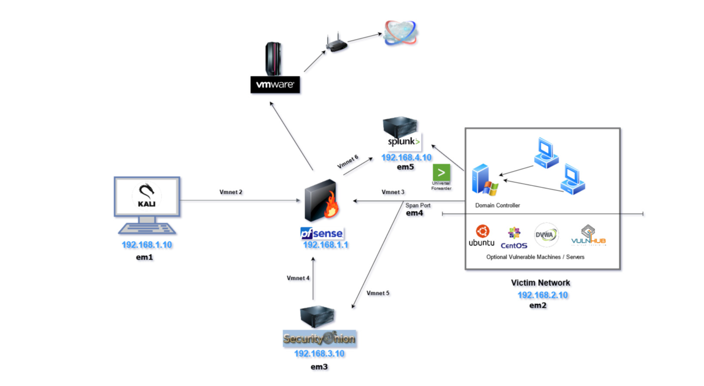

# 🏠 Homelab — pfSense‑segmented lab with Security Onion & Splunk

**Owner:** inksec.io (Tate)  
**Last updated:** 2025‑08‑21  
**Focus:** AD attacks in an isolated lab with full packet + log visibility



---

## 🔌 Segments & IP Plan
- **em1 — 192.168.1.0/24 (Tools/LAB):** pfSense `192.168.1.1`, **Kali** `192.168.1.10` (VMnet2)  
- **em2 — 192.168.2.0/24 (Victim Domain):** **DC + Win10 clients**  
- **em3 — 192.168.3.0/24 (SO mgmt):** **Security Onion AIO** `192.168.3.10` (VMnet4)  
- **em4 — SPAN (no IP):** mirror of victim traffic to SO sniff NIC  
- **em5 — 192.168.4.0/24 (SIEM):** **Splunk** `192.168.4.10` (VMnet6)  
- **WAN:** upstream via router → host → VMware → pfSense

```
Kali (192.168.1.10) ─ em1 ─ pfSense ─ em2 ─ Victim Network (DC + Win10s)
                                │
                              em4 (SPAN)  →  SO sniff NIC (no IP)
                                │
                              em3 (mgmt)  →  SO AIO (192.168.3.10)
                                │
                              em5 (SIEM)  →  Splunk (192.168.4.10)
```

---

## 🧰 Inventory
| Role | Hostname (ex) | OS | Joined to AD | Notes |
|---|---|---:|:---:|---|
| Firewall | `pfsense` | pfSense | n/a | Segmentation, NAT/Bridged, rules |
| IDS / SecOps | `so-aio` | Security Onion (AIO) | n/a | Zeek/Suricata + Elastic |
| Domain Controller | `dc01.lab.local` | Windows Server | n/a | AD DS + DNS (**Splunk UF installed ✅**) |
| Workstation | `win10-01.lab.local` | Windows 10 | ✅ | User desktop |
| Workstation | `win10-02.lab.local` | Windows 10 | ✅ | User desktop |
| Attack Box | `kali01` | Kali Linux | ❌ | Tooling for testing |
| Server | `ubuntu01` | Ubuntu Server | ❌ | Services / future sensors |
| SIEM/Search | `splunk01` | Splunk Enterprise | ❌ | Standalone indexer/search |

---

## 🔐 pfSense (Segmentation & Rules)
**Default‑deny** between em1/em2/em3/em5; allow only what’s needed.

- **Allow**
  - `LAB (em1) → Victim (em2)`: test ports you intend (e.g., 80/443/445/389/88/5985).  
  - `Victim → DC`: AD core flows (LDAP 389/636, Kerberos 88/464, DNS 53, SMB 445).  
  - `MGMT → all`: RDP/SSH/WinRM from admin jump box (optional).  
  - `Victim (em2) → em4`: mirror to SPAN; **SO sniff NIC** listens here (**no IP**).

- **DHCP/DNS**
  - pfSense: DHCP per segment.  
  - DC: authoritative DNS for `lab.local` on em2; Win10 clients point to DC.

---

## 🛰 Security Onion (AIO)
- **Mgmt NIC:** `em3` → `192.168.3.10` (Kibana/so-console).  
- **Sniff NIC:** `em4` (SPAN), **no IP**, promiscuous mode.  
- Visibility: full em2 traffic → **Zeek** metadata + **Suricata** alerts.

**Validate quickly**
1) Generate traffic from Win10 (SMB/DNS/HTTP).  
2) In SO, check Zeek `conn.log`, `dns.log`, SMB logs and Suricata alerts.

---

## 🔎 Splunk (192.168.4.10 on em5)
- Role: host/firewall logs & ad‑hoc analytics to complement SO.  
- **Status:** **Splunk Universal Forwarder already installed on DC ✅**.

**Suggested inputs**
- **pfSense → Splunk:** System Logs → Settings → *Remote Logging Options* → add Splunk `192.168.4.10` on `UDP 514` (or TCP if you prefer).  
- **Windows clients:** install Sysmon + Splunk UF → forward to `192.168.4.10:9997`.  
- **Linux (Ubuntu):** rsyslog or Splunk UF → `9997/tcp`.


---

## 🧪 Build Order (what I did)
1) **pfSense** with em1–em5 (+ em4 mirror), DHCP, baseline rules  
2) **Windows Server** → **AD DS/DNS** on em2  
3) **Win10‑01/02** domain‑joined (em2)  
4) **Security Onion AIO:** mgmt on em3, sniff on em4  
5) **Kali** on em1  
6) **Ubuntu** server  
7) **Splunk** on em5 (forwarder on DC ✅)

---

## 🧰 Runbooks
**New domain workstation (em2)** → Install Win10 → set DNS to **DC IP** → join domain → reboot → logon test.  
**SO capture check** → generate traffic → verify Zeek/Suricata in dashboards.  
**pfSense sanity** → interfaces/VMnet mapping, rule hits, DHCP leases, clients using DC DNS.

---

## 🚀 Next Steps
- Roll **Sysmon + Splunk UF** to Win10s; create win log index & dashboards.  
- Forward **pfSense** syslog to Splunk (and optionally to SO).  
- Add Ubuntu logs via rsyslog/UF.  
- Backups/snapshots: pfSense config export; DC/SO snapshots pre‑exercise.

---

